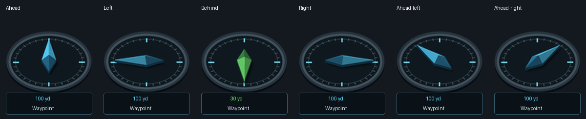

# Wayfinder compass, version 1.3.5

The waypoint indicator uses a raised, beveled needle over an elliptical charcoal
compass base. The longer cyan tip indicates the waypoint; its shorter, darker
tail is a counterweight. The needle and distance turn green inside 40 yards.



This is a generated artwork preview, not an in-game screenshot.

## Generation and heading convention

`tools/make_arrow.py` defines the needle vertices, bevel walls, ridge, camera,
light, and shadow. It draws all geometry procedurally, without loading source
artwork. A fixed orthographic camera at 42 degrees projects the model, and a
fixed light shades its faces while the needle yaws counterclockwise from forward.

128 frames of 128×128 pixels are packed into a 16-column, 8-row, 2048×1024 atlas.
Both this atlas and the 128×128 compass base are uncompressed 32-bit TGA files,
matching the format already used by Wayfinder. Transparent gutters prevent
neighboring frames from bleeding when textures are filtered. Atlas texture memory
is approximately 8 MiB; the game does not need to render a mesh each update.

Runtime bearing is `atan2(waypointWest - playerWest, waypointNorth - playerNorth)`
minus player facing. Frame 0 is ahead, 32 left, 64 behind, and 96 right. The nearest
frame limits rounding to approximately 1.4 degrees. Only the UV rectangle changes;
the texture and camera stay fixed, keeping lighting and perspective coherent.

Regenerate assets and illustrative previews with:

```
python tools/make_arrow.py --preview docs
```

`tools/make_icons.py` also regenerates these assets alongside the other map icons.
The compact readout and pointer retain saved position, scale, dragging, tooltip,
right-click removal, waypoint sharing, arrival clearing, and unavailable-position
or other-continent messages.

Clients already running during installation may require a full restart to discover
new textures. If the atlas cannot load, Wayfinder temporarily uses its existing
simple player-pointer artwork with the same bearing calculation and prints a
restart instruction.

## Audit and provenance

The locally installed BuddiesQuestForever 0.9.63 was compared with Wayfinder 1.3.4.
Their four corresponding floating-arrow textures had different file and decoded
pixel hashes. Wayfinder's assets were reproducible from its own icon generator.
The implementations also differed: Wayfinder calculated bearings in continent
world coordinates; Buddies used normalized map positions and map dimensions.

Those differences establish that the files and implementations were not identical;
they do not by themselves prove independent design history. The gold circular
arrow and distance plate were visually similar, so this release replaces that
presentation with newly defined geometry, new artwork, and a different layout.

No permissively licensed upstream origin for Buddies' arrow was identified in
the inspected package. Its optional TomTom integration forwards waypoints and
does not establish the arrow's provenance. Buddies' installed license reserves
rights and prohibits copying/modification/redistribution without written permission.
This redesign does not rely on permission from Buddies or TomTom and contains no
artwork copied from either project.

Automated checks cover cardinal and diagonal bearings, wraparound, frame UVs,
asset dimensions and format, transparent gutters, controls, and waypoint behavior.
Visual inspection covers rendered directional frames and the native-size preview.
In-game appearance and controls still need verification in an active client before
claiming client verification. The broader data migration and GPL license remain
as documented separately.
